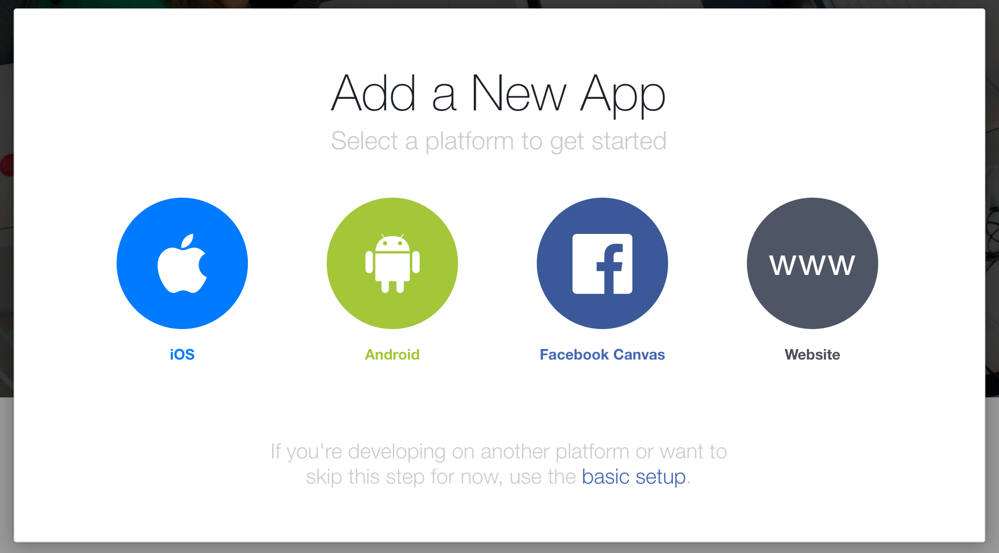
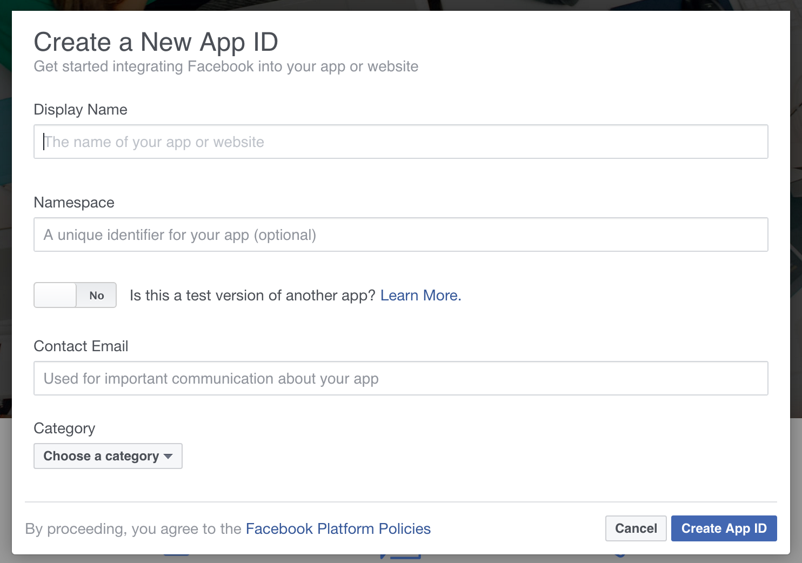
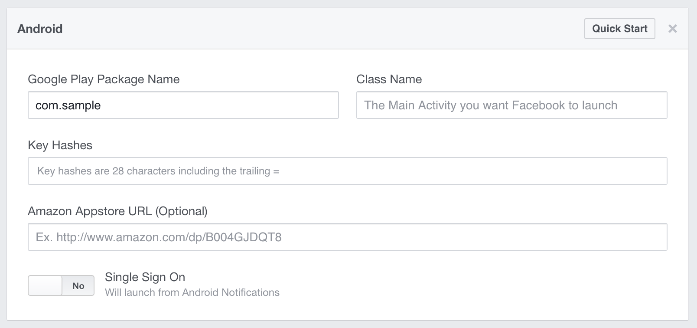

# nativescript-facebook-oauth

Facebook SDKを使用して、iOS、Android共にOAuth認証を実現するNativeScriptプラグインです。

## 使い方

### インストール

```bash
npm install nativescript-facebook-oauth
```

### Android

`your_app/App_Resources/Android/values/strings.xml`を作成し下記のコードを入力してください。

```xml
<?xml version="1.0" encoding="utf-8"?>
<resources>
    <string name="app_name">sample</string>
    <string name="title_activity_kimera">sample</string>
    <string name="facebook_app_id">{your-app-id}</string>
</resources>
```

`your_app/App_Resources/Android/AndroidManifest.xml`に下記の`uses-permission` `meta-data` `activity`を追加してください。

```xml
<?xml version="1.0" encoding="utf-8"?>
<manifest>
	<uses-permission android:name="android.permission.INTERNET"/>
    ...
	<application>
        ...
		<meta-data android:name="com.facebook.sdk.ApplicationId" android:value="@string/facebook_app_id"/>
		<activity android:name="com.facebook.FacebookActivity"
		          android:configChanges="keyboard|keyboardHidden|screenLayout|screenSize|orientation"
		          android:theme="@android:style/Theme.Translucent.NoTitleBar"
		          android:label="@string/app_name"/>
        ...
	</application>
</manifest>
```

### iOS

`your_app/App_Resources/iOS/Info.plist`の最下部にある`</dict>`の前に下記のコードを追加してください([詳細](https://developers.facebook.com/docs/ios/getting-started#configure-xcode-project))。

```xml
<key>CFBundleURLTypes</key>
<array>
  <dict>
    <key>CFBundleURLSchemes</key>
    <array>
      <string>fb{your-app-id}</string>
    </array>
  </dict>
</array>
<key>FacebookAppID</key>
<string>{your-app-id}</string>
<key>FacebookDisplayName</key>
<string>{your-app-name}</string>
<key>LSApplicationQueriesSchemes</key>
<array>
  <string>fbapi</string>
  <string>fb-messenger-api</string>
  <string>fbauth2</string>
  <string>fbshareextension</string>
</array>
```

下記のコードを追加し、Objective-Cの`AppDelegate`クラスを`FBSDKApplicationDelegate`にconnectしてください([詳細](https://developers.facebook.com/docs/ios/getting-started#connect-app-delegate))。

```js
import { connectToFacebookDelegate } from "nativescript-facebook-oauth";
connectToFacebookDelegate();
application.start({ moduleName: "main-page" });
```

### Android/iOS共通

```js
import { FacebookLoginHandler } from "nativescript-facebook-oauth";

// コールバックの処理
const successCallback = function(result) {
  console.log(result.token);
};

const cancelCallback = function() {
  console.log("Login was cancelled");
};

const failCallback = function(error) {
  console.log(error);
};

// ログインの処理
const facebookLoginHandler = new FacebookLoginHandler();
facebookLoginHandler.logInWithReadPermissions(["email"], successCallback, cancelCallback, failCallback); // Permissionsを追加 https://developers.facebook.com/docs/facebook-login/permissions
```


## 検証の手順

`sample`以下にサンプルアプリケーションを作成してあります。

## Facebook Applicationの作成

[Facebook developers](https://developers.facebook.com/)で検証用のアプリケーションを作成します。



`basic setup`を選択します。



`Display Name` `Contact Email` `Category`を入力します。

`Create App ID`でApplicationが作成されます。`Setting`を選択し、`+Add Platform`をクリック、Androidを選択します。



検証用なので、`Google Play Package Name`だけ入力します。これでApplicationの作成は完了です。

## Application IDの読み込み

Androidの検証では`sample/app/App_Resources/Android/values/strings.xml`の`{your-app-id}`を作成したアプリケーションの`Application ID`に、iOSの検証では`sample/app/App_Resources/iOS/Info.plist`の`{your-app-id}`を作成したアプリケーションの`Application ID`に、`{your-app-name}`をアプリケーションの名前に置き換えてください。

## サンプルアプリの実行

下記コマンドで実行できます。

### 初回

```
cd sample
tns install
tns platform add [ios | android]
tns run [ios | android]
```

### 2回目以降

```
cd sample
tns plugin remove nativescript-facebook-oauth && tns plugin add ../
tns run [ios | android]
```
